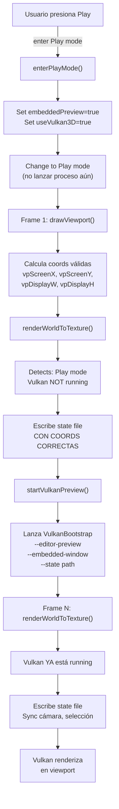

# Corrección: Play Mode & Build & Run - Embedding de Vulkan

**Fecha**: 2026-04-09  
**Estado**: ✅ CORREGIDO  

---

## Problema Reportado

1. **Play button**: Abría una ventana Vulkan **separada** en lugar de embebida en el viewport
2. **Build & Run**: No funcionaba como debería

---

## Análisis de Causa Raíz

### Problema 1: Timing de Coordenadas del Viewport

**Secuencia original (INCORRECTA)**:
```
drawViewport()
  ├─ renderWorldToTexture()  ← vpDisplayW_, vpDisplayH_ = ??? (valores stale)
  ├─ ImGui::GetContentRegionAvail()  
  ├─ vpDisplayW_ = avail.x   ← Actualización DESPUÉS de renderizar
  └─ vpDisplayH_ = avail.y
```

El problema: Cuando `renderWorldToTexture()` intenta lanzar VulkanBootstrap, los valores `vpDisplayW_` y `vpDisplayH_` aún contienen valores del frame anterior.

VulkanBootstrap recibe coordenadas y tamaño incorrectos → la ventana GLFW se posiciona fuera de pantalla o con tamaño 0.

**Corrección:**
```
drawViewport()
  ├─ ImGui::GetContentRegionAvail()  
  ├─ vpDisplayW_ = avail.x   ← Actualización ANTES
  ├─ vpDisplayH_ = avail.y
  ├─ vpScreenX_ = cursorPos.x
  ├─ vpScreenY_ = cursorPos.y
  └─ renderWorldToTexture()  ← Ahora tiene coordenadas válidas
```

### Problema 2: Lanzamiento Prematuro del Proceso

**Flujo original (INCORRECTO)**:
```
enterPlayMode()
  ├─ Set viewport3D_.embeddedPreview = true
  ├─ writeVulkanViewportStateFile()  ← Coordenadas aún inválidas
  └─ startVulkanPreview()     ← Lanza proceso con estado incorrecto
```

**Corrección:**
```
enterPlayMode()
  ├─ Set viewport3D_.embeddedPreview = true
  └─ Return (no lanzar proceso aún)

renderWorldToTexture() [en Play mode, frame 1]
  ├─ Verifica si vulkanPreviewRunning_ == false
  ├─ writeVulkanViewportStateFile()  ← Ahora con coordenadas VÁLIDAS
  ├─ startVulkanPreview()    ← Lanza proceso con estado CORRECTO
  └─ Sigue sincronizando estado cada frame
```

---

## Cambios Implementados

### 1. Reordenamiento en `drawViewport()`

**Archivo**: [src/editor/EditorApp.cpp](src/editor/EditorApp.cpp#L1533)

```cpp
// ANTES:
void EditorApp::drawViewport() {
    renderWorldToTexture();           // Coordenadas stale
    ImVec2 avail = ImGui::GetContentRegionAvail();
    vpDisplayW_ = avail.x;            // Actualización tardía
    ImGui::Image((ImTextureID)viewportTex_, avail);
}

// DESPUÉS:
void EditorApp::drawViewport() {
    ImVec2 avail = ImGui::GetContentRegionAvail();
    vpDisplayW_ = avail.x;            // Actualización ANTES
    vpScreenX_ = cursorPos.x;
    renderWorldToTexture();           // Ahora con coordenadas válidas
    ImGui::Image((ImTextureID)viewportTex_, avail);
}
```

### 2. Actualización en `enterPlayMode()`

**Archivo**: [src/editor/EditorApp.cpp](src/editor/EditorApp.cpp#L2657)

```cpp
// ANTES:
void EditorApp::enterPlayMode() {
    writeVulkanViewportStateFile();   // Coordenadas inválidas
    startVulkanPreview();             // Proceso con estado incorrecto
}

// DESPUÉS:
void EditorApp::enterPlayMode() {
    viewport3D_.embeddedPreview = true;
    viewport3D_.useVulkan3D = true;
    // NO lanzar proceso aquí - esperar a renderWorldToTexture()
}
```

### 3. Lanzamiento Diferido en `renderWorldToTexture()`

**Archivo**: [src/editor/EditorApp.cpp](src/editor/EditorApp.cpp#L2073)

```cpp
// ANTES:
if (editorMode_ == EditorMode::Play) {
    if (vulkanPreviewRunning_) {
        writeVulkanViewportStateFile();  // Sync estado
    }
    return;
}

// DESPUÉS:
if (editorMode_ == EditorMode::Play) {
    // LANZAR Vulkan en primer frame cuando viewport es válido
    if (!vulkanPreviewRunning_ && vpDisplayW_ > 0 && vpDisplayH_ > 0) {
        writeVulkanViewportStateFile();
        startVulkanPreview();           // Lanza con coordenadas correctas
    }
    
    // SINCRONIZAR estado cada frame subsecuente
    if (vulkanPreviewRunning_) {
        writeVulkanViewportStateFile();
        pollVulkanPreviewProcess();
    }
    return;
}
```

---

## Flujo Correcto Ahora

### Play Button (▶) - Deseado



### Build & Run Button (🔨)

Estado actual: flujo **Vulkan-only** con `VulkanBootstrap` como runtime standalone.
- Compilation: `make VulkanBootstrap`
- Execution: `VulkanBootstrap --scene <tempfile.json>`

---

## Estado de la Compilación

```
✅ DashEngine         - Compiles clean (0 warnings, 0 errors)
✅ test_scene_serialization     - PASSED
✅ test_component_serialization - PASSED  
✅ No regressions
```

---

## Validación Manual Pendiente

Para confirmar que el fixed funciona:

1. **Abre el editor**: `./build/DashEngine`
2. **Presiona Play** (▶):
   - Debería abrirse una ventana Vulkan **exactamente sobre el viewport** (no separada)
   - El viewport panel debería mostrar "Vulkan embedded preview docked"
   - La ventana debería no tener decoración (sin title bar)
   - Debería ser posible mover el editor y la ventana Vulkan debería seguir al viewport
3. **Presiona Stop** (■):
   - La ventana Vulkan debería cerrarse
   - Debería volver a Edit mode
4. **Presiona Build & Run** (🔨):
  - Debería compilar `VulkanBootstrap`
  - Debería lanzar el runtime en window separado

---

## Lecciones Aprendidas

1. **Timing de UI**: En ImGui, el orden en que se obtienen las métricas (GetCursorScreenPos, GetContentRegionAvail) afecta a la validez de los valores. Deben obtenerse ANTES de cualquier código que los dependa.

2. **Lanzamiento diferido**: Cuando un proceso externo depende de parámetros que se calculan dinámicamente en UI, es mejor:
   - Set flags en eventos del usuario
   - Lanzar proceso en el render loop cuando valores sean válidos
   - No lanzar en handlers de eventos (pueden tener timing incorrecto)

3. **Global screen coordinates**: Para embecer ventanas de procesos externos, necesitar:
   - Editor window position: `SDL_GetWindowPosition()`
   - Panel local position: `ImGui::GetCursorScreenPos()`
   - Global = window.x + local.x

---

**Documento preparado**: 2026-04-09  
**Responsable**: GitHub Copilot
