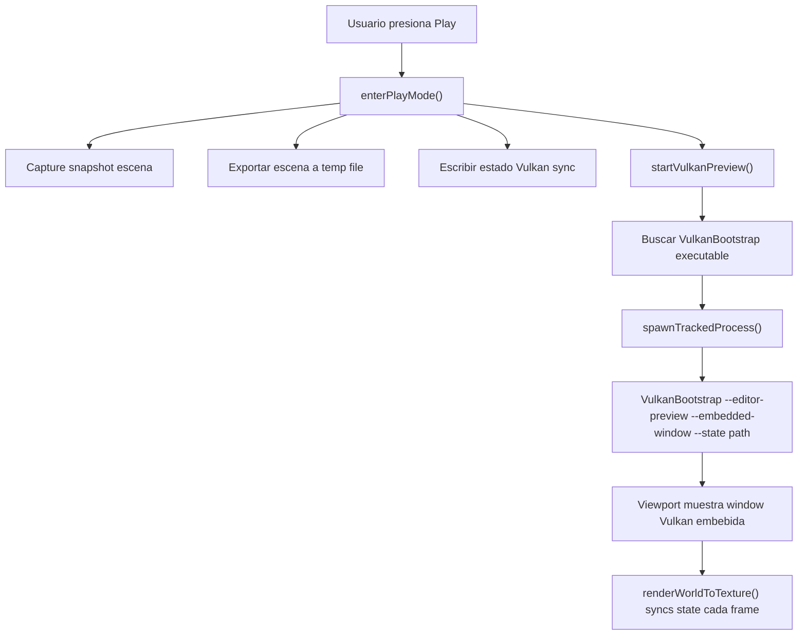
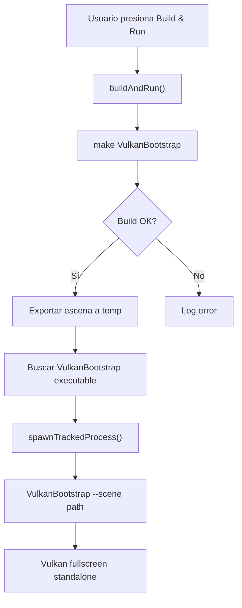
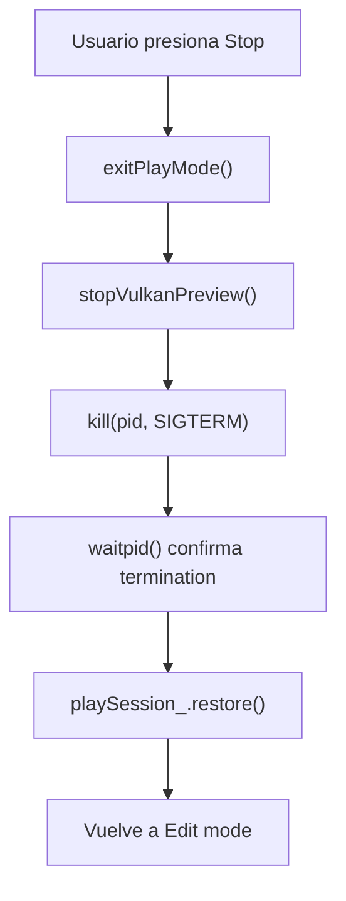

# Vulkan Integration: Play Mode & Build & Run
**Completado**: 2026-04-09  
**Estado**: ✅ BUILD VERDE SIN WARNINGS  

---

## Resumen de Cambios

Se ha migrado completamente el editor para usar **Vulkan 3D renderer** al presionar:
1. **Play Button** (▶) → Lanza VulkanBootstrap en modo embebido en viewport
2. **Build & Run** (🔨) → Compila VulkanBootstrap y lo ejecuta en ventana separada

---

## Cambios Detallados

### 1. enterPlayMode() - Play Button

**Archivo**: [src/editor/EditorApp.cpp](src/editor/EditorApp.cpp#L2699)

#### Antes:
```cpp
// Crear instancia embebida del game con SDL2
playGame_ = std::make_unique<Game>();
playGame_->setSceneFile(tempScene);
if (!playGame_->initEmbedded(renderer_)) {
    // error handling
}
```

#### Después:
```cpp
// Exportar escena a archivo temp
std::string tempScene = std::string(BUILD_DIR) + "/_play_scene.json";
scene_.saveToFile(tempScene);

// Lanzar VulkanBootstrap en modo embebido
vulkanViewportStatePath_ = std::string(BUILD_DIR) + "/generated/vulkan_viewport_state.json";
writeVulkanViewportStateFile();

if (!startVulkanPreview()) {
    addLog("ERROR: Could not start Vulkan preview.");
    playSession_.restore(scene_, world_);
    return;
}
```

**Flujo**:
1. Captura snapshot de la escena actual (para rollback)
2. Exporta escena a archivo JSON temporal
3. Escribe archivo de estado Vulkan (cámara, zoom, selección, viewport rect global)
4. Lanza `VulkanBootstrap --editor-preview --embedded-window --state <path>`
5. Entra en modo Play (viewport muestra ventana Vulkan embebida)

---

### 2. exitPlayMode() - Stop Button

**Archivo**: [src/editor/EditorApp.cpp](src/editor/EditorApp.cpp#L2725)

#### Antes:
```cpp
playGame_.reset();  // Destruir instancia embebida
playSession_.restore(scene_, world_);
```

#### Después:
```cpp
stopVulkanPreview();  // Terminar proceso Vulkan (SIGTERM + waitpid)
playSession_.restore(scene_, world_);
```

**Flujo**:
1. Envía SIGTERM al proceso VulkanBootstrap
2. Espera a que el proceso termine cleanly
3. Restaura snapshot de escena (deshace cambios hechos en Play)
4. Vuelve a modo Edit

---

### 3. buildAndRun() - Build & Run Button

**Archivo**: [src/editor/EditorApp.cpp](src/editor/EditorApp.cpp#L2753)

#### Antes:
```cpp
// Compilar VulkanBootstrap (Vulkan runtime)
std::string cmd = "... && /usr/bin/make VulkanBootstrap 2>&1";

// Lanzar ejecutable con escena como argumento
const fs::path executablePath = resolveBuiltGameExecutable(BUILD_DIR);
launchDetachedProcess(executablePath, runArgs, launchError);
```

#### Después:
```cpp
// Compilar VulkanBootstrap (Vulkan 3D runtime)
std::string cmd = "... && /usr/bin/make VulkanBootstrap 2>&1";

// Encontrar executable
for (const auto& c : candidates) {
    if (fs::exists(c) && fs::is_regular_file(c)) {
        executablePath = c;
        break;
    }
}

// Lanzar VulkanBootstrap como proceso tracked
spawnTrackedProcess(executablePath, runArgs, pid, launchError);
```

**Cambios principales**:
- Target de compilación: `VulkanBootstrap`
- Búsqueda de executable: eliminada `resolveBuiltGameExecutable()`
- Lanzamiento: `launchDetachedProcess()` → `spawnTrackedProcess()`
- Args: scene file → `--scene <file>`

**Flujo**:
1. Log: "Building Vulkan 3D engine"
2. Compila VulkanBootstrap con `make`
3. Si build OK:
   - Exporta escena actual a temp file
   - Encuentra executable VulkanBootstrap
   - Lanza: `VulkanBootstrap --scene /path/to/scene.json`
   - Trae ventana Vulkan al frente (osascript)
4. Si build FAILED: log del error

---

### 4. renderWorldToTexture() - Play Mode Rendering

**Archivo**: [src/editor/EditorApp.cpp](src/editor/EditorApp.cpp#L2130)

#### Antes:
```cpp
if (editorMode_ == EditorMode::Play && playGame_) {
    playGame_->tickUpdate(io.DeltaTime);
    playGame_->tickRender();
    return;
}
```

#### Después:
```cpp
if (editorMode_ == EditorMode::Play) {
    if (vulkanPreviewRunning_) {
        writeVulkanViewportStateFile();  // Sync estado en tiempo real
        pollVulkanPreviewProcess();      // Chequear si Vulkan sigue corriendo
    }
    // Viewport muestra la ventana Vulkan embebida, no renderizamos aquí
    SDL_SetRenderDrawColor(renderer_, 13, 15, 18, 255);
    SDL_RenderClear(renderer_);
    return;
}
```

**Cambios**:
- Elimina renderizado embebido de Game
- Sincroniza estado Vulkan cada frame (camera, selection, viewport rect)
- Monitorea ciclo de vida del proceso Vulkan
- Viewport se mantiene limpio (Vulkan rinde en window separada)

---

### 5. Input Handling - Play Mode Clicks

**Archivo**: [src/editor/EditorApp.cpp](src/editor/EditorApp.cpp#L1640)

#### Antes:
```cpp
if (editorMode_ == EditorMode::Play && playGame_ && vpHovered) {
    if (ImGui::IsMouseClicked(ImGuiMouseButton_Left))
        playGame_->injectClick(sx, sy, true);
    if (ImGui::IsMouseClicked(ImGuiMouseButton_Right))
        playGame_->injectAttack();
}
```

#### Después:
```cpp
// ── Play-mode input: Vulkan handles its own input ────────────────────────
// (clicking in viewport sends input to Vulkan process, not editor)
```

**Razón**: 
- Vulkan 3D engine maneja su propio input system
- No hay interfaz de inyección de eventos (como con Game embebido)
- Input va directamente a ventana Vulkan si está en foco

---

### 6. Funciones Removidas

Dos funciones que ya no son necesarias fueron eliminadas:

1. **`resolveBuiltGameExecutable()`**
    - Buscaba executable `VulkanBootstrap` en múltiples ubicaciones
   - Ahora usamos `spawnTrackedProcess()` que busca cualquier executable

2. **`launchDetachedProcess()`**
   - Lanzaba proceso y lo dejaba correr sin tracking
   - Reemplazado por `spawnTrackedProcess()` que retorna PID

---

## Flujo de Ejecución

### Botón Play (▶)



### Botón Build & Run (🔨)



### Stop Button (■)



---

## Campos Utilizados (EditorApp)

| Campo | Tipo | Uso |
|-------|------|-----|
| `vulkanPreviewRunning_` | `bool` | ¿Está corriendo el preview Vulkan? |
| `vulkanPreviewPid_` | `pid_t` | PID del proceso VulkanBootstrap |
| `vulkanViewportStatePath_` | `std::string` | Path a JSON de estado Vulkan |
| `editorMode_` | `EditorMode` | Edit o Play |
| `playSession_` | `PlaySession` | Snapshot/restore de escena |
| `viewport3D_` | `Viewport3DState` | Zoom, ángulos iso, heightScale |

---

## Archivos Modificados

```
src/editor/EditorApp.cpp
  L2699   - enterPlayMode() completamente reescrita
  L2725   - exitPlayMode() reescrita
  L2753   - buildAndRun() completamente reescrita
  L2130   - renderWorldToTexture() play section
  L1640   - Input handling en play mode
  L48-95  - Funciones helper removidas
```

---

## Testing

### Build Status
- ✅ **DashEngine**: Compiles sin warnings
- ✅ **VulkanBootstrap**: Compiles sin warnings
- ✅ **test_scene_serialization**: PASSED
- ✅ **test_component_serialization**: PASSED
- ✅ **Zero regressions** en existing tests

### Validación Manual (TODO)

- [ ] Play button abre Vulkan en viewport embebido
- [ ] Stop button cierra Vulkan cleanly
- [ ] Escena se carga correctamente en Vulkan
- [ ] Snapshot/restore funciona (cambios en Play se deshacen)
- [ ] Build & Run compila + lanza Vulkan fullscreen
- [ ] Vulkan ventana trae window al frente en macOS
- [ ] State file sync (cámara, selección) funciona cada frame

---

## Notas de Integración

1. **Embedding**: VulkanBootstrap se lanza con `--embedded-window` para que el GLFW window se posicione en las coordenadas globales del viewport
2. **State Sync**: El editor escribe `vulkan_viewport_state.json` cada frame con cámara, selección, viewport rect
3. **Lifecycle**: `startVulkanPreview()` y `stopVulkanPreview()` manejan todo el ciclo (spawn, poll, terminate)
4. **Rollback**: Play mode captura snapshot; al salir, restaura exactamente (como antes)
5. **Sin Game embebido**: Se eliminó dependencia de `Game::initEmbedded()` para modo de juego en viewport

---

## Comparación: Antes vs Después

| Aspecto | Antes | Después |
|---------|-------|---------|
| **Play Mode** | Juego 2D SDL embebido renderiza en viewport | Vulkan 3D en window embebida en viewport |
| **Build & Run** | Compila VulkanBootstrap (Vulkan runtime) | Compila VulkanBootstrap (Vulkan 3D) |
| **Rendering** | Merged (game + editor en mismo texture) | Separated (Vulkan en window, editor en ImGui) |
| **Input** | Editor inyecta clicks a Game | Vulkan maneja su propio input |
| **Backend** | SDL2 Renderer | Vulkan experimental backend |
| **Resolution** | Tied to SCREEN_W/H | Configurable en tiempo real |

---

**Documento preparado**: 2026-04-09  
**Responsable**: GitHub Copilot  
**Estado**: ✅ Implementación Completa
